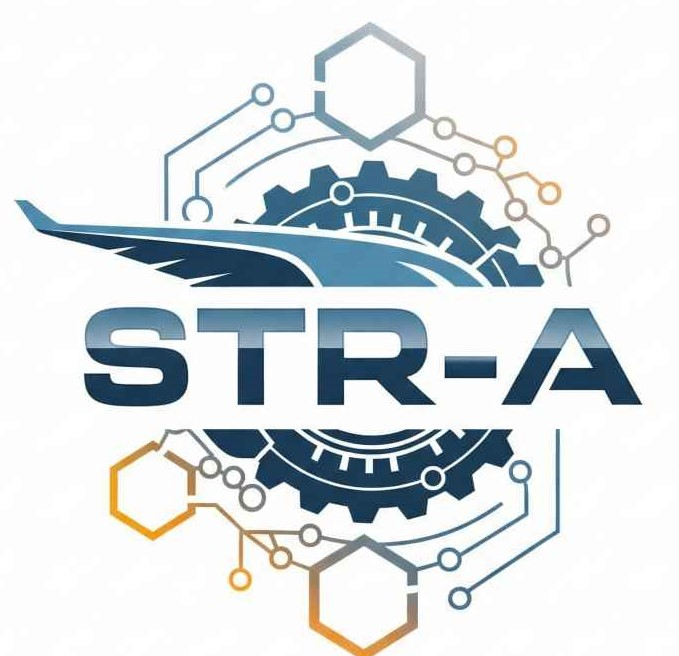

# 🚀 Sistema de Trazabilidad de Repuestos Aeronáuticos (STRA) Basado en Blockchain

<p align="center">
    
</p>

---

## 💡 Visión General del Proyecto

El Sistema de Trazabilidad de Repuestos Aeronáuticos (STRA) es una aplicación web descentralizada (dApp) diseñada para revolucionar la gestión y el seguimiento de los componentes críticos en la industria de la aviación. Aprovechando el poder de la tecnología blockchain, STRA proporciona un registro inmutable, transparente y auditable de cada evento en el ciclo de vida de un repuesto, desde su fabricación hasta su instalación, mantenimiento, remoción y eventual desguace o reinstalación.

El objetivo principal es combatir la falsificación de piezas, mejorar la seguridad, agilizar las auditorías y proporcionar a todas las partes interesadas (fabricantes, MROs, operadores, reguladores) una fuente de verdad única y confiable sobre el historial de cada componente.

---

## 🎯 Objetivos Clave

* **Garantizar la Autenticidad:** Proporcionar un medio infalible para verificar la procedencia y autenticidad de cada repuesto aeronáutico.
* **Mejorar la Transparencia:** Ofrecer visibilidad completa del historial de un componente a las partes autorizadas.
* **Aumentar la Seguridad:** Reducir los riesgos asociados con componentes no certificados o con historiales dudosos.
* **Optimizar la Auditoría:** Simplificar los procesos de cumplimiento y auditoría regulatoria.
* **Promover la Confianza:** Establecer un ecosistema de confianza entre los participantes de la cadena de suministro aeronáutica.

---

## 🌟 Características Destacadas

### 🌐 Funcionalidades del Frontend (Interfaz de Usuario)

* **Dashboard Interactivo:** Un panel central intuitivo que permite a los usuarios interactuar con el contrato inteligente.
    * **Registro de Piezas:** Los fabricantes pueden registrar nuevas piezas con su número de serie, número de parte, fabricante inicial y hash del documento de fabricación.
    * **Consulta Detallada:** Cualquiera puede consultar el estado actual y el historial completo de eventos de cualquier pieza ingresando su número de serie.
    * **Actualización de Estado:** MROs y Operadores pueden registrar nuevos eventos (instalación, reparación, remoción, etc.) con hashes de documentos de soporte.
    * **Transferencia de Propiedad:** Los propietarios actuales pueden transferir la titularidad de una pieza a otra dirección blockchain.
    * **Administración de Roles:** Los administradores pueden conceder o revocar roles (Fabricante, MRO, Operador, Administrador) a direcciones de billetera, controlando el acceso a las funciones críticas del sistema.
* **Conexión a Billetera Web3:** Integración fluida con MetaMask para conectar la billetera del usuario y realizar transacciones.
* **Estado de Conexión y Rol del Usuario:** Indicadores visuales en el dashboard muestran si la billetera está conectada y el rol asignado al usuario actual.
* **Generador de Hash SHA-256:** Una página dedicada para calcular el hash de cualquier texto o documento, crucial para asociar documentación física o digital a las entradas de blockchain.
* **Modo Oscuro/Claro:** Alterna la interfaz entre un tema de color claro y oscuro para mejorar la ergonomía visual y la preferencia del usuario. La elección del tema se guarda en el navegador.
* **Navegación Responsiva:** Un menú de hamburguesa adaptable que garantiza una experiencia de usuario óptima en todos los dispositivos (escritorio, tabletas y móviles).
* **Favicon Personalizado:** Un icono distintivo en la pestaña del navegador para una fácil identificación del sitio.

### ⛓️ Funcionalidades del Contrato Inteligente (Blockchain)


* **`registerPart(serialNumber, partNumber, manufacturerName, initialOwner, initialDocHash)`:** Registra una nueva pieza en la blockchain, disponible solo para cuentas con el rol `MANUFACTURER_ROLE`.
* **`updatePartState(serialNumber, newStatus, location, docHashes, additionalData)`:** Añade un nuevo evento al historial de una pieza existente, disponible para cuentas con los roles `MRO_ROLE` o `OPERATOR_ROLE`.
* **`transferOwnership(serialNumber, newOwner)`:** Transfiere la propiedad de una pieza, solo accesible para el propietario actual de la pieza.
* **`getPartDetails(serialNumber)`:** Recupera los detalles básicos de una pieza.
* **`getPartHistory(serialNumber)`:** Devuelve el historial completo de eventos de una pieza, incluyendo estado, ubicación, fecha/hora, quién realizó la acción y hashes de documentos asociados.
* **`grantRole(account, role)` / `revokeRole(account, role)`:** Funciones de administración de acceso para conceder/revocar roles a cuentas específicas, disponible solo para cuentas con el rol `ADMIN_ROLE`.
* **Roles Basados en OpenZeppelin (Ejemplo):** Utiliza un sistema de roles para controlar quién puede ejecutar qué funciones dentro del contrato, como `ADMIN_ROLE`, `MANUFACTURER_ROLE`, `MRO_ROLE`, `OPERATOR_ROLE`.

---

## 🛠️ Tecnologías Utilizadas

Este proyecto se construye sobre una pila tecnológica moderna y robusta:

* **Frontend:**
    * **HTML5:** Para la estructura semántica del contenido web.
    * **CSS3:** Para el estilizado y diseño, incluyendo el uso de [Custom Properties (Variables CSS)](https://developer.mozilla.org/en-US/docs/Web/CSS/Using_CSS_custom_properties) para una gestión de temas eficiente (modo oscuro/claro) y `@media queries` para la responsividad.
    * **JavaScript (ES6+):** Para la lógica interactiva del frontend, manipulación del DOM, gestión de eventos y la comunicación con la blockchain.

## 📦 Estructura del Proyecto

La organización del repositorio sigue una estructura lógica para separar el frontend, los assets y los scripts:
### 📂 Estructura del Proyecto
 ``` 
STR-A/
├── estilos/
│   ├── contacto.css
│   ├── convertidor.css
│   ├── glosario.css
│   ├── info.css
│   ├── panel_trazabilidad.css
│   ├── style.css
│   └── usuario.css
├── imag/
│   ├── logo6.png
│   └── ... (otros archivos de imágenes)
├── scripts/
│   ├── contacto.js
│   ├── convertidor.js
│   ├── glosario.js
│   ├── index.js
│   ├── info.js
│   ├── panel_trazabilidad.js
│   └── usuario.js
├── contacto.html
├── convertidor.html
├── glosario.html
├── index.html
├── info.html
├── panel_trazabilidad.html
├── README.md
├── usuario.html
```

### Vídeo Demostración del Sistema STR-A
[](https://www.youtube.com/watch?v=lwLgduCLkAY)
